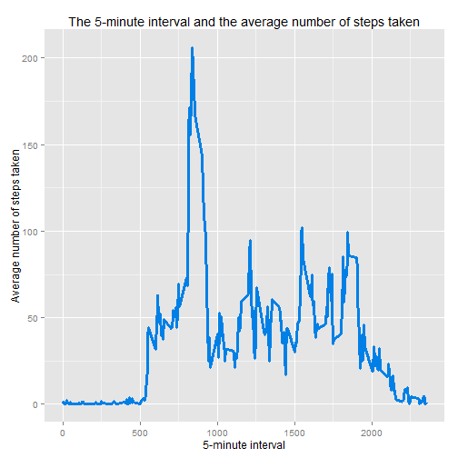
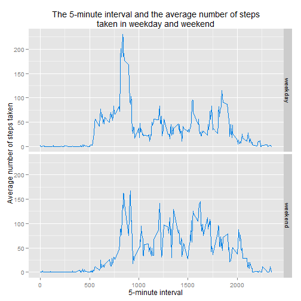

## Load library

```r
library(ggplot2)
library(dplyr)
library(knitr)
library(lubridate)
library(scales)
library(xtable)
```


## What is mean total number of steps taken per day?

```r
activity <- read.csv("activity.csv", stringsAsFactors = FALSE)
originalData <- tbl_df(activity)
data <- originalData %>% filter(!is.na(steps))
data <- data %>% mutate(date = as.Date(ymd(date)))
```

## What is the average daily activity pattern?
### Total number of steps taken per day

```r
byDate <- data %>% group_by(date)
histOfStepsData <- byDate %>% summarize(total_steps = sum(steps))
histOfSteps <- ggplot(histOfStepsData, aes(total_steps))
print(
    histOfSteps +
    geom_histogram(binwidth = 2500, col = rgb(0.9, 0.5, 0), fill = rgb(0, 0.5, 0.9)) +
    xlab("Total steps taken per day") +
    ylab("Number of days") +
    ggtitle("Total steps taken per day")
)
```

 

### The mean and median total number of steps taken per day

```r
meanSteps <- mean(histOfStepsData$total_steps)
medianSteps <- median(histOfStepsData$total_steps)
```
The mean is 10,766.19 and the median is 10,765

## What is the average daily activity pattern?
### Plot of average number of steps taken per interval

```r
byInterval <- data %>% group_by(interval)
histOfIntervalData <- byInterval %>% mutate(
    average_step = mean(steps)
) 
histOfInterval <- ggplot(histOfIntervalData, aes(interval, average_step))
print(
    histOfInterval +
        geom_line(size = 1.3, col = rgb(0, 0.5, 0.9)) +
        xlab("5-minute interval") +
        ylab("Average number of steps taken") +
        ggtitle("The 5-minute interval and the average number of steps taken")
)
```

 

### Which 5-minute interval, on average across all the days in the dataset, contains the maximum number of steps?

```r
byInterval <- data %>% group_by(interval)
averageStepData <- byInterval %>% summarize(
        average_step = mean(steps)
) 
maxStep <- max(averageStepData$average_step)
intervalContainMaxSteps <- averageStepData %>% 
    filter(average_step - maxStep >= .0 )
intervalContainMaxStep <- intervalContainMaxSteps$interval
```

**835** is 5-minute interval, on average across all the days in the dataset, contains the maximum number of steps.

## Imputing missing values

```r
missingVal <- originalData %>% filter(is.na(steps))
numOfMissingVal <- nrow(missingVal)
```
 
1. Total number of missing values in the dataset is **2304**.

 
2, 3. **Devise a strategy for filling in all of the missing values in the dataset.**


```r
filledData <- originalData %>% 
    group_by(interval) %>%
    mutate(steps = ifelse(is.na(steps), mean(steps, na.rm = TRUE), steps))
```

4. Make a histogram of the total number of steps taken each day and Calculate and report the mean and median total number of steps taken per day. Do these values differ from the estimates from the first part of the assignment? What is the impact of imputing missing data on the estimates of the total daily number of steps?

**Total number of steps taken per day**

```r
filledData <- filledData %>%  mutate(date = as.Date(ymd(date)))
byDate <- filledData %>% group_by(date)
histOfStepsData <- byDate %>% summarize(total_steps = sum(steps))
histOfSteps <- ggplot(histOfStepsData, aes(total_steps))
print(
    histOfSteps +
    geom_histogram(binwidth = 2500, col = rgb(0.9, 0.5, 0), fill = rgb(0, 0.5, 0.9)) +
    xlab("Total steps taken per day") +
    ylab("Number of days") +
    ggtitle("Total steps taken per day")
)
```

 

**The mean and median total number of steps taken per day with filled data**

```r
meanSteps <- mean(histOfStepsData$total_steps)
medianSteps <- median(histOfStepsData$total_steps)
```
The mean is 10,766.19 and the median is 10,766.19


**Look at plot and table, we can see that the total number of steps taken as well as mean and median is quite diffenrent from the data without filling missing value**

**Imputing missing data help we have an overview of total steps on each day although these steps may missing in some period of a day**

## Are there differences in activity patterns between weekdays and weekends?
### Create a new factor variable in the dataset with two levels - "weekday" and "weekend" indicating whether a given date is a weekday or weekend day.

```r
intervalWeekend <- filledData %>% 
    mutate(week_day = ifelse(wday(date) == 1 |wday(date) == 7, "weekend", "weekday"))
intervalWeekend  <- intervalWeekend %>% mutate(week_day = factor(week_day))
intervalWeekend  <- intervalWeekend %>% group_by(interval, week_day) %>% summarise(average_step = mean(steps))
```

### Make a panel plot containing a time series plot (i.e. type = "l") of the 5-minute interval (x-axis) and the average number of steps taken, averaged across all weekday days or weekend days (y-axis).

```r
print(
    ggplot(intervalWeekend, aes(interval, average_step)) +
    facet_grid(week_day~.) +
    geom_line(col = rgb(0, 0.5, 0.9)) +
    xlab("5-minute interval") +
    ylab("Average number of steps taken") +
    ggtitle("The 5-minute interval and the average number of steps\ntaken in weekday and weekend")
)
```

 
